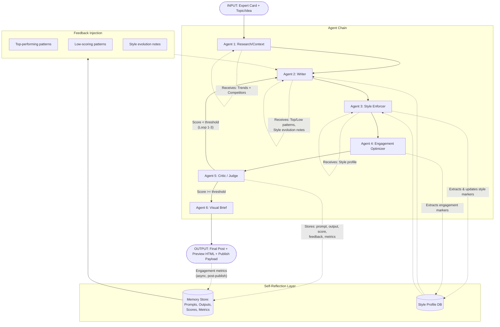
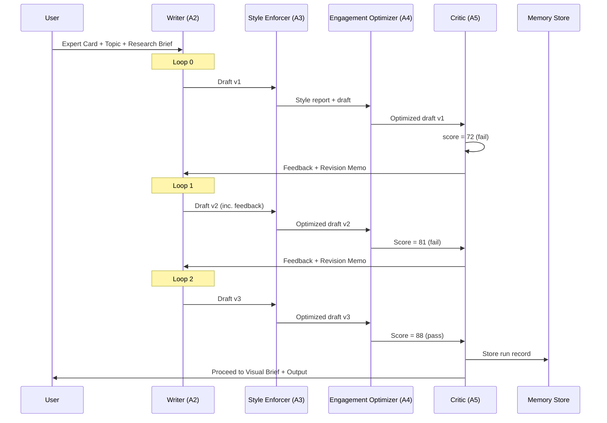

# Agent Chain Architecture: Social Media Content Production

## Overview

This document defines the full agent chain architecture for producing and publishing social media content (posts and Reels/scripts) with built-in **self-reflection** and **style adaptation** capabilities. The system is designed for the `content-producer` SaaS platform, which enables AI-powered content production for experts.

---

## Core Principles

1. **Expert Fidelity**: Every output must authentically reflect the expert's voice, expertise, and brand.
2. **Platform Optimization**: Content is tuned for the target platform (LinkedIn, Instagram, X/Twitter, TikTok, etc.).
3. **Continuous Learning**: The system improves over time by analyzing its own outputs and real-world engagement data.
4. **Iterative Refinement**: Content is scored, criticized, and refined before finalization.
5. **Separation of Concerns**: Each agent has a single, well-defined responsibility.

---

## System Flow (High-Level)

```
INPUT: Expert Card + Topic/Idea
  ↓
Agent 1: Research/Context Agent
  ↓
Agent 2: Writer Agent (draft)
  ↓
Agent 3: Style Enforcer Agent
  ↓
Agent 4: Engagement Optimizer Agent
  ↓
Agent 5: Critic/Judge Agent → [IF score < threshold] → loop to Writer (max 3)
  ↓
Agent 6: Visual Brief Agent
  ↓
OUTPUT: Final post + preview HTML + publish-ready payload
```

---

## Mermaid Diagram: Full Agent Chain Flow



---

## Agent Definitions

### Agent 1: Research / Context Agent

| Attribute | Specification |
|-----------|---------------|
| **Name** | Research/Context Agent |
| **Purpose** | Gathers timely information to make the content relevant, competitive, and informed. Analyzes competitor content in the expert's niche. Suggests hooks and angles that are currently resonating with audiences. |
| **LLM Model** | `gpt-4o-mini` (fast, cost-effective; research synthesis is bounded) |
| **System Prompt Summary** | "You are a research analyst for a social media content strategist. Given an expert's domain and a topic, search and synthesize trending conversations, viral hooks in the niche, competitor content patterns, and relevant data points. Output a structured brief with 3 suggested angles and 3 hook options." |
| **Input** | - `expert_card`: Expert Card (industry, topics, audience)<br/>- `topic`: Topic or idea string<br/>- `platform`: Target platform (e.g., "LinkedIn", "Instagram")<br/>- `content_type`: "post" or "reel/script" |
| **Output** | `ResearchBrief`:<br/>- `trend_summary`: 3-5 bullet points on what's trending in the niche<br/>- `competitor_hooks`: 2-3 examples of high-performing hooks from competitors<br/>- `suggested_angles`: 3 distinct angles tailored to the expert<br/>- `data_points`: Any relevant statistics, quotes, or facts<br/>- `risk_flags`: Potential controversies or sensitive topics to avoid |
| **Tools / APIs** | - Platform-native search APIs (e.g., X API, Reddit search)<br/>- Web scraping layer (if permitted)<br/>- Historical trend database (internal) |
| **Special Logic** | If `content_type` = "reel/script", prioritizes visual storytelling angles and trending audio/caption styles. |

---

### Agent 2: Writer Agent

| Attribute | Specification |
|-----------|---------------|
| **Name** | Writer Agent |
| **Purpose** | Generates the first draft of the content (post or script) in the expert's authentic voice. This agent is the creative core of the chain. |
| **LLM Model** | `gpt-4o` (requires high creativity, nuanced voice replication, and long-context understanding) |
| **System Prompt Summary** | "You are a ghostwriter who deeply understands the expert's voice and perspective. Write the draft content using the provided research brief, expert card, and feedback history. Adhere strictly to the style profile: vocabulary, tone, sentence length, humor level, story structure. If feedback from previous loops is present, incorporate it directly." |
| **Input** | - `expert_card`: Full Expert Card (personality, expertise, product info, style profile)<br/>- `topic`: Topic/idea string<br/>- `research_brief`: Output from Agent 1<br/>- `platform`: Target platform<br/>- `content_type`: "post" or "reel/script"<br/>- **Feedback loop inputs** (if present):<br/>&nbsp;&nbsp;- `loop_iteration`: Integer (0, 1, 2)<br/>&nbsp;&nbsp;- `critic_feedback`: String from Agent 5<br/>&nbsp;&nbsp;- `top_performing_posts`: List of past high-performing posts for this expert<br/>&nbsp;&nbsp;- `low_scoring_patterns`: Patterns that previously scored poorly<br/>&nbsp;&nbsp;- `style_evolution_notes`: How the expert's voice has been tuned over time |
| **Output** | `DraftContent`:<br/>- `raw_text`: The full draft text<br/>- `draft_metadata`:<br/>&nbsp;&nbsp;- `hook_used`: Which hook from Agent 1 was chosen<br/>&nbsp;&nbsp;- `structure_type`: "story", "listicle", "contrarian", "how-to", "hot-take", etc.<br/>&nbsp;&nbsp;- `estimated_read_time`: For posts<br/>&nbsp;&nbsp;- `estimated_duration_sec`: For scripts |
| **Temperature** | 0.75 (high creativity, but structured by Expert Card) |
| **Loop Behavior** | On loop re-entry, the Writer receives explicit `critic_feedback` prefixed to its prompt. The system appends: `"PREVIOUS DRAFT FEEDBACK:"` before the new generation. Max 3 loops (initial + 3 revisions = 4 total drafts max). |

---

### Agent 3: Style Enforcer Agent

| Attribute | Specification |
|-----------|---------------|
| **Name** | Style Enforcer Agent |
| **Purpose** | Audits the draft against the expert's style profile. Ensures tonal consistency, vocabulary alignment, sentence structure adherence, humor-level accuracy, and emoji/styling rules. |
| **LLM Model** | `gpt-4o-mini` (structured comparison task, cost-effective) |
| **System Prompt Summary** | "You are a strict brand voice editor. Compare the provided draft text to the expert's style profile. Identify ALL deviations. Return a structured report with specific line-by-line corrections and a pass/fail decision. If the draft passes, return an empty corrections list." |
| **Input** | - `expert_card`: Full Expert Card<br/>- `style_profile`: The current style profile (vocabulary, tone, sentence length, humor level, emoji usage, story structure)<br/>- `draft_content`: Output from Agent 2<br/>- `platform`: Target platform<br/>- `content_type`: "post" or "reel/script" |
| **Output** | `StyleReport`:<br/>- `pass`: Boolean (true if no major deviations)<br/>- `deviations`: Array of objects:<br/>&nbsp;&nbsp;- `line`: Excerpted text<br/>&nbsp;&nbsp;- `issue`: Description of the deviation<br/>&nbsp;&nbsp;- `suggested_replacement`: Corrected text<br/>- `tone_score`: 0-100 (how well tone matches)<br/>- `vocabulary_score`: 0-100<br/>- `structure_score`: 0-100<br/>- `overall_style_score`: 0-100 (weighted average) |
| **Special Logic** | If `pass` = false, the deviations are **NOT** automatically applied. Instead, they are appended as `style_feedback` to the Writer Agent's next prompt on the next loop. However, on the final loop regardless of pass/fail, the highest-scoring version is forwarded to Agent 4. The Style Enforcer also **extracts style markers** from the draft for incremental profile updates (see Style Adaptation below). |

---

### Agent 4: Engagement Optimizer Agent

| Attribute | Specification |
|-----------|---------------|
| **Name** | Engagement Optimizer Agent |
| **Purpose** | Adds platform-specific engagement mechanics: hooks, CTAs, formatting (line breaks, emoji placement), hashtag sets, and readability tuning. Ensures the content is algorithmically and psychologically optimized for the chosen platform. |
| **LLM Model** | `gpt-4o-mini` (rule-based platform optimization, cost-effective) |
| **System Prompt Summary** | "You are a social media engagement specialist. Take the draft and optimize it for the target platform. Add hooks, CTAs, formatting, emoji, and hashtags according to the expert's emoji_usage rules. Do NOT alter the core message or expert's voice. Return the fully formatted content." |
| **Input** | - `draft_content`: Output from Agent 2 (or after loops)<br/>- `style_profile`: Style profile (especially `emoji_usage`, `humor_level`)<br/>- `platform`: Target platform<br/>- `content_type`: "post" or "reel/script"<br/>- `research_brief`: Output from Agent 1 (for hook alignment) |
| **Output** | `OptimizedContent`:<br/>- `final_text`: The fully formatted and optimized text<br/>- `formatting_log`: Array of changes made:<br/>&nbsp;&nbsp;- `change`: Description<br/>&nbsp;&nbsp;- `reason`: Why it improves engagement<br/>- `hook_final`: The final hook used (first line)<br/>- `cta`: The call-to-action included<br/>- `hashtags`: Array of hashtags (if platform-appropriate)<br/>- `line_breaks_added`: Count<br/>- `emoji_count`: Total emoji used |
| **Platform Rules** | - **LinkedIn**: Professional tone, minimal emoji, line breaks after every 1-2 sentences, hashtag count max 3<br/>- **Instagram**: Higher emoji density, aesthetic line breaks, hashtag max 15 (hidden or visible)<br/>- **X/Twitter**: Character-limit aware, thread planning if needed, punchy CTAs<br/>- **TikTok/Reels**: Hook in first 3s, short sentences, visual cues in `( )`, script rhythm notes |
| **Special Logic** | This agent also **extracts engagement markers** (which CTAs, hooks, and formatting patterns were used) and stores them for style profile updates. |

---

### Agent 5: Critic / Judge Agent

| Attribute | Specification |
|-----------|---------------|
| **Name** | Critic / Judge Agent |
| **Purpose** | Provides a rigorous, multi-dimensional score of the content. This is the gatekeeper: if scores are below threshold, the draft loops back to the Writer Agent with specific, actionable feedback. |
| **LLM Model** | `gpt-4o` (requires deep judgment, nuance, and comparative analysis; this is the most expensive but most important step) |
| **System Prompt Summary** | "You are a senior content strategist and brand consultant. Score the provided content across four dimensions. Be specific, constructive, and honest. If the content is not publication-ready, provide a prioritized list of improvements. Reference the expert's past top-performing content and low-scoring patterns in your assessment." |
| **Input** | - `expert_card`: Full Expert Card<br/>- `style_profile`: Current style profile<br/>- `optimized_content`: Output from Agent 4<br/>- `draft_metadata`: From Agent 2 (structure_type, hook_used)<br/>- `platform`: Target platform<br/>- `content_type`: "post" or "reel/script"<br/>- `top_performing_posts`: Past high-performers for this expert<br/>- `low_scoring_patterns`: Past low-performers or patterns to avoid<br/>- `loop_iteration`: Current loop count (0 = first pass) |
| **Output** | `CriticScorecard`:<br/>- `engagement_potential`: Score 0-100 + justification<br/>- `authenticity`: Score 0-100 + justification (does it sound like the expert?)<br/>- `brand_alignment`: Score 0-100 + justification (alignment with expert's brand/product)<br/>- `platform_fit`: Score 0-100 + justification (is it right for this platform?)<br/>- `overall_score`: Weighted average (0-100)<br/>- `threshold`: The passing score (default: 85)<br/>- `pass`: Boolean (`overall_score >= threshold`)<br/>- `improvement_suggestions`: Prioritized array of strings (if `pass` = false)<br/>- `confidence`: Low / Medium / High (model's certainty in scores) |
| **Scoring Weights** | `overall_score` = 0.30 × engagement + 0.30 × authenticity + 0.25 × brand_alignment + 0.15 × platform_fit |
| **Loop Logic** | If `pass` = false AND `loop_iteration` < 3:<br/>- Store the scorecard in a `revision_memo`<br/>- Feed `improvement_suggestions` back to Writer Agent<br/>- Increment `loop_iteration`<br/>If `pass` = false AND `loop_iteration` >= 3:<br/>- Take the **highest-scoring version** across all loops<br/>- Log a warning: "Content did not pass threshold after 3 revisions. Publishing best-effort version."<br/>- Proceed to Agent 6 |
| **Storage** | After finalization (pass or final loop), the Critic's full scorecard, the final content, and all intermediate drafts are written to the Memory Store for self-reflection. |

---

### Agent 6: Visual Brief Agent

| Attribute | Specification |
|-----------|---------------|
| **Name** | Visual Brief Agent |
| **Purpose** | Generates structured prompts and briefs for the visual assets needed (images, carousels, Reels, video scripts). Bridges text content to visual production. |
| **LLM Model** | `gpt-4o` (requires strong visual-to-text reasoning) |
| **System Prompt Summary** | "You are a creative director and prompt engineer. Given a finalized social media post, generate detailed image/video generation prompts and visual direction briefs. Ensure the visual style matches the expert's brand and the emotional tone of the content." |
| **Input** | - `final_content`: Output from Agent 4<br/>- `expert_card`: Full Expert Card (includes brand colors, visual style preferences)<br/>- `platform`: Target platform<br/>- `content_type`: "post" or "reel/script"<br/>- `critic_scorecard`: From Agent 5 (to understand emotional tone and key messages) |
| **Output** | `VisualBrief`:<br/>- `asset_type`: "single_image", "carousel", "reel", "story", "video_short"<br/>- `image_prompts`: Array of prompt strings (for DALL-E / Midjourney / Stable Diffusion)<br/>- `reel_storyboard`: Array of scene descriptions (if `content_type` = "reel/script"):<br/>&nbsp;&nbsp;- `scene_num`<br/>&nbsp;&nbsp;- `visual_description`<br/>&nbsp;&nbsp;- `duration_sec`<br/>&nbsp;&nbsp;- `text_overlay`: Optional<br/>&nbsp;&nbsp;- `audio_note`: Voiceover or trending audio suggestion<br/>- `caption_for_cover`: Text for the cover image / thumbnail<br/>- `brand_consistency_check`: Notes on color, font, logo placement<br/>- `estimated_production_time`: Minutes |
| **Special Logic** | If `content_type` = "post" and the platform supports images, generate 1-3 image prompts. If the platform is text-only (e.g., X), skip image generation and return a `text-only` asset_type. |

---

## Final Output Assembly

The system assembles the following deliverable package:

| Field | Description |
|-------|-------------|
| `final_post_text` | The finalized, optimized text from Agent 4 |
| `preview_html` | A rendered HTML preview simulating the post on the target platform (for review UI) |
| `publish_ready_payload` | Platform-specific JSON payload ready for API posting |
| `visual_brief` | Output from Agent 6 (prompts, storyboards, specs) |
| `critic_scorecard` | Full scoring report from Agent 5 (for user review) |
| `revision_history` | Array of all drafts and feedback across loops |
| `style_profile_snapshot` | The style profile as it existed at generation time |
| `metadata` | Timestamps, agent versions, loop count, model used |

---

## Self-Reflection Mechanism

### 1. Memory Store Schema

After each run (regardless of pass/fail), the following record is stored:

```json
{
  "run_id": "uuid",
  "expert_id": "expert_uuid",
  "timestamp": "ISO-8601",
  "prompt": {
    "expert_card_version": "hash_of_card",
    "topic": "string",
    "platform": "LinkedIn",
    "content_type": "post"
  },
  "outputs": {
    "research_brief": "...",
    "draft_content_v1": "...",
    "draft_content_v2": "...",
    "optimized_content": "...",
    "visual_brief": "..."
  },
  "critic_scorecard": { ... },
  "expert_feedback": null,
  "final_engagement_metrics": {
    "likes": 0,
    "comments": 0,
    "shares": 0,
    "reach": 0,
    "ctr": 0.0,
    "engagement_rate": 0.0
  },
  "loop_count": 1,
  "style_profile_snapshot": { ... }
}
```

### 2. Feedback Injection for Subsequent Runs

Before the Writer Agent (Agent 2) begins on any NEW run for an expert, the system queries the Memory Store and injects:

**A. Top-Performing Posts for This Expert (Past N Runs)**

```
"Here are {N} top-performing posts for this expert in the past {time_window}:

1. POST: [excerpt]
   STRUCTURE: [story/listicle etc.]
   HOOK: [first line]
   ENGAGEMENT RATE: [X%]
   WHY IT WORKED: [auto-generated or expert-annotated reason]

2. ..."
```

**B. Patterns That Scored Low**

```
"Here are patterns that scored poorly for this expert — AVOID:

- Pattern: '[description]' | Seen in runs: [X, Y, Z] | Avg engagement: [low]
- Pattern: '[description]' | Seen in runs: [A, B] | Critic flagged: [reason]"
```

**C. Style Evolution Notes**

```
"Style Evolution for this expert:

- Initial humor level: 3/10 → Current: 6/10 (audience responded well to dry wit)
- Emoji usage: Was 0 → Now 2-3 per post (LinkedIn optimal)
- Sentence length: Initially 45 words avg → Now 25 words avg (higher engagement)
- Preferred story structure: Moved from 'problem-solution' to 'contrarian-then-proof'"
```

### 3. Expert Feedback Loop

If the expert provides feedback on published content (e.g., "too salesy", "loved the hook"), this feedback is:
1. Stored in the Memory Store record under `expert_feedback`
2. Vector-embedded and stored in a retrieval-augmented memory
3. Automatically injected into future prompts for that expert, weighted more heavily than auto-critic scores

---

## Style Adaptation System

### 1. Expert Card Style Profile

Each Expert Card includes a mutable `style_profile` object:

```json
{
  "vocabulary": {
    "preferred_terms": ["bootstrapping", "funnel", "CAC", "LTV"],
    "avoided_terms": ["guru", "hustle", "crushing it"],
    "formality_level": 7,
    "industry_jargon_density": 0.4
  },
  "tone": {
    "primary": "confident_authoritative",
    "secondary": "empathetic",
    "formality": "semi-formal",
    "assertiveness": 0.8
  },
  "sentence_structure": {
    "avg_length_words": 25,
    "variance": 8,
    "preferred_patterns": ["short_long_short", "question_then_answer"],
    "paragraph_max_lines": 3
  },
  "humor_level": {
    "score": 5,
    "type": "dry_wit",
    "frequency": "occasional"
  },
  "emoji_usage": {
    "enabled": true,
    "avg_count": 2,
    "preferred_set": ["💡", "🚀", "📊"],
    "platform_variance": {
      "LinkedIn": {"avg_count": 1, "style": "professional"},
      "Instagram": {"avg_count": 5, "style": "playful"}
    }
  },
  "story_structure": {
    "preferred_frameworks": ["hook-story-lesson-cta", "contrarian_evidence_payoff"],
    "openings": ["I made a $10M mistake...", "The biggest lie in SaaS is..."],
    "closings": ["What's your take?", "DM me if you want the breakdown"]
  }
}
```

### 2. Style Marker Extraction (Post-Generation)

After each run, **both Agent 3 (Style Enforcer) and Agent 4 (Engagement Optimizer)** extract markers from the final generated text:

**Agent 3 extracts:**
- Actual vocabulary used (new terms not in profile)
- Actual sentence lengths (update avg_length_words, variance)
- Actual paragraph structures
- Actual humor instances (type, placement)
- Actual emoji usage (count, types, placement)

**Agent 4 extracts:**
- Hook structures that were chosen
- CTA structures that were chosen
- Formatting patterns (line break cadence)
- Engagement signal strength (predicted, from its own optimization log)

### 3. Incremental Profile Updates (Learning)

The system compares the **extracted markers** to the **current style profile** and applies a weighted update:

```
new_value = (current_value × (1 - learning_rate)) + (extracted_value × learning_rate)
```

Default `learning_rate` = 0.15 (conservative; requires 6-7 runs to significantly shift a trait).

**Update Rules:**
- If a new term appears in 3+ consecutive runs, add to `preferred_terms`
- If `avg_length_words` deviates >10% from profile for 3+ runs, update
- If emoji count on a platform consistently yields high engagement, nudge platform-specific averages
- If a story structure was used and the post performed well, increase its weight in `preferred_frameworks`
- If a pattern was flagged by the Critic Agent across multiple runs, add it to `avoided_terms` or penalize its framework weight

### 4. Human Override Gate

All style profile updates are **soft suggestions** by default. The changes are:
1. Accumulated in a `pending_style_changes` queue
2. Shown to the expert in a "Style Insights" dashboard weekly
3. Applied automatically ONLY if the expert has enabled "Auto-Adapt My Voice"
4. Otherwise, the expert reviews and approves/rejects each change

---

## Loop Mechanics Detail



### Loop Guardrails

- **Max loops**: 3 (initial + 3 revisions = 4 drafts total)
- **Early exit**: If `overall_score` >= threshold at any loop, exit immediately
- **Fallback**: If no draft passes after max loops, select the draft with the highest historical `overall_score` across all loops
- **Cost protection**: Loop iteration adds latency but is bounded; Writer Agent uses `gpt-4o`, so max spend per run is 4x Writer + 1x Critic call
- **Feedback deduplication**: The system hashes improvement suggestions; if the Critic repeats the same feedback across loops, it is automatically escalated in priority and the system logs a "stuck" warning

---

## Error Handling & Edge Cases

| Scenario | Behavior |
|----------|----------|
| Research Agent finds no trends | Uses generic hooks from the expert's top-performing posts instead; logs a "data gap" warning. |
| Writer Agent produces off-brand content despite style injection | Style Enforcer blocks it; if it reaches Critic, authenticity score will likely trigger a loop. If max loops reached, return best-effort with a prominent warning flag. |
| Style profile is brand new (no history) | Runs in "discovery mode" for the first 3 runs: Style Enforcer is more lenient (threshold 70), and updates are applied with a higher learning rate (0.30) to converge faster. |
| Expert feedback contradicts critic scores | Expert feedback always overrides critic scores for style/tone. System stores this as a "human preference" and reweights future critic prompts. |
| Content type = reel, but expert has no video history | Visual Brief falls back to a "starter template" for the platform; warns the user that performance prediction is low-confidence. |
| Platform API changes formatting rules | Engagement Optimizer has a `platform_rules_version` in its prompt; rules are fetched from a CDN before each run. |

---

## Cost & Performance Estimates

| Metric | Estimate |
|--------|----------|
| Avg tokens per run (no loops) | ~12,000 input + ~6,000 output |
| Avg tokens per run (2 loops) | ~28,000 input + ~14,000 output |
| Estimated cost per run (GPT-4o + GPT-4o-mini mix) | $0.15 – $0.45 |
| Avg latency (no loops, sequential) | 15-25 seconds |
| Avg latency (with 2 loops) | 35-55 seconds |
| P95 latency | < 90 seconds |

---

## Future Extensions (Out of Scope for v1)

1. **Parallel Agent Execution**: Research Agent and Style Enforcer can run in parallel where inputs don't depend on each other.
2. **Multi-Platform Adaptation**: Generate for LinkedIn AND Instagram in one run by forking after the Writer Agent.
3. **A/B Test Generation**: Produce 2 variants from the Writer Agent and have the Critic score both.
4. **Real-Time Trend Injection**: Connect Research Agent to live X/Reddit firehoses for minute-relevant hooks.
5. **Multi-Expert Collaboration**: Allow two experts to co-author a post (e.g., podcast guest format).

---

## Glossary

- **Expert Card**: The structured profile defining an expert's personality, expertise, products, audience, and style.
- **Style Profile**: A mutable, machine-readable subset of the Expert Card that defines voice mechanics.
- **Publish-Ready Payload**: A JSON object formatted for direct injection into a social media platform's API (e.g., LinkedIn REST API, Instagram Graph API).
- **Revision Memo**: The structured feedback package sent from the Critic Agent back to the Writer Agent during a loop.
- **Discovery Mode**: The first 3 runs for a new expert where the system learns their style with higher tolerance and faster adaptation.
